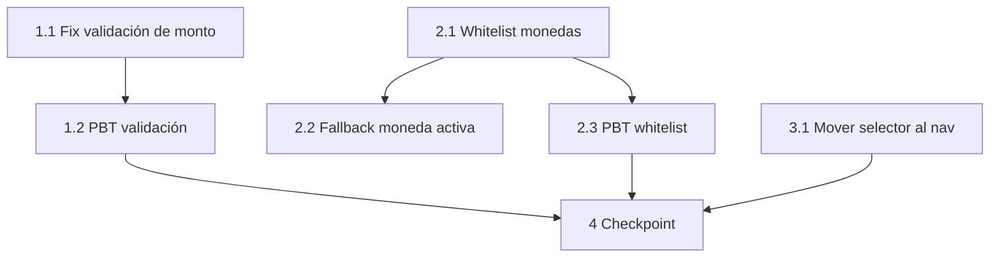

# Implementation Tasks: currency-ux-fixes

## Task Dependency Graph

## Tasks

### 1. Fix de validación de monto en formulario de transacciones
- [x] 1.1 Corregir comparación en `validar()` de `FormularioTransaccion.vue`
  - En `frontend/src/components/dashboard/FormularioTransaccion.vue`, modificar la función `validar()`
  - Cambiar `if (form.monto >= ingresoDisponible.value)` por `const limiteEnMonedaActiva = divisaStore.convertirDesdeUSD(ingresoDisponible.value); if (form.monto >= limiteEnMonedaActiva)`
  - Esto convierte el ingreso disponible (en USD) a la moneda activa antes de comparar
  - _Requisitos: 1.1, 1.2, 1.3, 1.4_
- [x] 1.2 Escribir property test para validación con conversión (Propiedad 1)
  - Archivo: `frontend/src/stores/__tests__/divisa.pbt.spec.js` (append)
  - Para todo monto M > 0, tasa T > 0, ingreso I > 0: la validación acepta M si y solo si M < I * T
  - Usar pinia store con tasas configuradas, verificar que `convertirDesdeUSD(ingreso)` produce el límite correcto y la comparación `monto >= limite` se evalúa correctamente
  - **Valida: Requisito 1, Propiedad de Correctitud 1**

### 2. Whitelist de monedas principales en el store de divisa
- [x] 2.1 Agregar constante `MONEDAS_PRINCIPALES` y filtrar `monedasDisponibles`
  - En `frontend/src/stores/divisa.js`:
  - Agregar constante `MONEDAS_PRINCIPALES = ['USD', 'EUR', 'GBP', 'JPY', 'CLP', 'ARS', 'BRL', 'MXN', 'CAD', 'AUD', 'CNY', 'CHF', 'COP', 'PEN']`
  - Reemplazar el computed `monedasDisponibles` para filtrar solo monedas de la whitelist que tengan tasa disponible (USD siempre incluido)
  - Exportar `MONEDAS_PRINCIPALES` en el return del store
  - _Requisitos: 2.1, 2.2, 2.4_
- [x] 2.2 Agregar fallback a USD cuando moneda activa no está en whitelist
  - En `frontend/src/stores/divisa.js`, dentro de `cargarTasas()`:
  - Después de cargar tasas exitosamente, verificar si `monedaActiva.value` está en `MONEDAS_PRINCIPALES`
  - Si no está, llamar `seleccionarMoneda('USD')`
  - _Requisitos: 2.3_
- [x] 2.3 Escribir property test para whitelist de monedas (Propiedad 2)
  - Archivo: `frontend/src/stores/__tests__/divisa.pbt.spec.js` (append)
  - Para todo mapa de tasas arbitrario: `monedasDisponibles` ⊆ `MONEDAS_PRINCIPALES` Y cada código ≠ USD tiene tasa > 0 en el store
  - Verificar que USD siempre está presente en la lista resultante
  - **Valida: Requisito 2, Propiedad de Correctitud 2**

### 3. Reubicar selector de moneda en el nav
- [x] 3.1 Mover `SelectorMoneda` del área de usuario al nav central
  - En `frontend/src/components/nav/AppNav.vue`:
  - Remover `<SelectorMoneda />` del div derecho (área de usuario)
  - Agregar `<SelectorMoneda v-if="auth.sesionActiva" />` dentro del `<nav>` central, después de los RouterLinks
  - El selector heredará `hidden md:flex` del padre nav
  - _Requisitos: 3.1, 3.2, 3.3, 3.4_

### 4. Checkpoint - Verificar todos los cambios
- [x] 4. Ejecutar tests y build
  - Ejecutar `npx vitest run` en el directorio frontend
  - Verificar que todos los property tests (P1-P8 existentes + P9 y P10 nuevos) pasan
  - Ejecutar `npm run build` para verificar que no hay errores de compilación
  - Confirmar que los tests existentes no se rompieron
