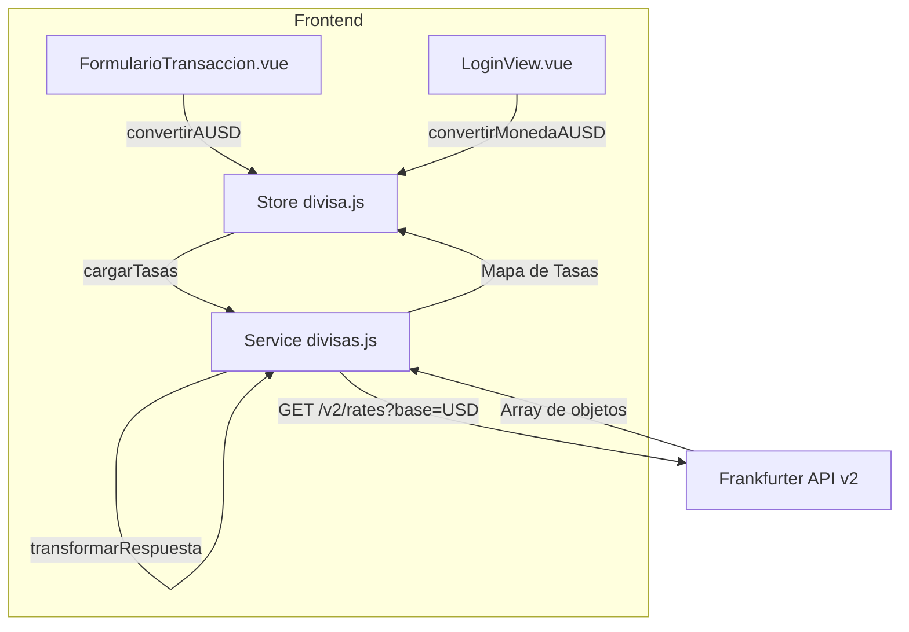

# Documento de Diseño: Frankfurter v2 Transaction Conversion

## Visión General

Este diseño aborda la migración del servicio de divisas desde la API de Frankfurter v1 (endpoint muerto `https://api.frankfurter.app/latest`) hacia la v2 (`https://api.frankfurter.dev/v2/rates`). El cambio principal es que v2 retorna un **array de objetos** en lugar del mapa plano que retornaba v1, por lo que se necesita una función de transformación.

El alcance del cambio es mínimo y focalizado:
1. **`src/services/divisas.js`** — Nuevo endpoint, timeout, y transformación de respuesta.
2. **`src/stores/divisa.js`** — Guard defensivo en `convertirMonedaAUSD` para evitar `NaN` cuando una moneda no existe en el mapa.

Los componentes consumidores (`FormularioTransaccion.vue`, `LoginView.vue`) **no requieren cambios** porque ya usan la interfaz pública del store correctamente.

### Decisiones de Diseño

| Decisión | Justificación |
|----------|---------------|
| Solo modificar `divisas.js` y `divisa.js` | Minimizar superficie de cambio; la interfaz pública del store se mantiene idéntica |
| Timeout de 10s en axios | Frankfurter es API pública sin SLA; 10s es suficiente para respuestas típicas (<500ms) pero protege contra cuelgues |
| Fallback de factor 1 en error | Permite al usuario seguir registrando transacciones aunque sin conversión real; la UI puede avisar via `error: true` |
| Última entrada prevalece en duplicados | La API v2 no debería retornar duplicados, pero el parseo defensivo evita comportamiento indefinido |

---

## Arquitectura



### Flujo de Datos

1. El componente (o composable) invoca `divisaStore.cargarTasas()`.
2. El store llama a `obtenerTasasDeCambio()` del servicio.
3. El servicio hace `GET https://api.frankfurter.dev/v2/rates?base=USD` con timeout de 10s.
4. La respuesta (array) se transforma en `Record<string, number>` mediante `transformarRespuestaV2()`.
5. El store almacena el mapa en `tasas` reactivo.
6. Las funciones de conversión (`convertirAUSD`, `convertirDesdeUSD`, `convertirMonedaAUSD`) operan sobre el mapa almacenado.

---

## Componentes e Interfaces

### Servicio de Divisas (`src/services/divisas.js`)

```javascript
// Constantes
const FRANKFURTER_URL = 'https://api.frankfurter.dev/v2/rates'
const TIMEOUT_MS = 10000

// Tipos (JSDoc)
/**
 * @typedef {{ date: string, base: string, quote: string, rate: number }} EntradaTasa
 */

/**
 * Transforma el array de respuesta v2 en un mapa quote → rate.
 * - Excluye entradas donde quote === base (USD).
 * - Si hay duplicados de quote, la última entrada prevalece.
 * @param {EntradaTasa[]} entradas - Array de la respuesta de Frankfurter v2
 * @returns {Record<string, number>} Mapa de tasas
 */
export function transformarRespuestaV2(entradas) {
  const mapa = {}
  for (const entrada of entradas) {
    if (entrada.quote !== entrada.base) {
      mapa[entrada.quote] = entrada.rate
    }
  }
  return mapa
}

/**
 * Obtiene las tasas de cambio desde Frankfurter API v2.
 * @returns {Promise<Record<string, number>>} Mapa código_moneda → tasa
 * @throws {Error} Si la API falla, timeout, o error de red
 */
export async function obtenerTasasDeCambio() {
  const { data } = await axios.get(FRANKFURTER_URL, {
    params: { base: 'USD' },
    timeout: TIMEOUT_MS,
  })
  return transformarRespuestaV2(data)
}
```

**Nota:** La función `transformarRespuestaV2` se exporta separadamente para facilitar testing unitario y PBT sin necesidad de mockear axios.

### Store de Divisa (`src/stores/divisa.js`)

El único cambio requerido es en `convertirMonedaAUSD`:

```javascript
// ANTES (puede retornar NaN si codigoMoneda no existe):
function convertirMonedaAUSD(monto, codigoMoneda) {
  return codigoMoneda === 'USD' ? monto : monto / tasas.value[codigoMoneda]
}

// DESPUÉS (guard defensivo):
function convertirMonedaAUSD(monto, codigoMoneda) {
  if (!Number.isFinite(monto) || monto <= 0) return 0
  if (codigoMoneda === 'USD') return monto
  const tasa = tasas.value[codigoMoneda]
  if (!tasa || tasa <= 0) return monto
  return monto / tasa
}
```

**Interfaz pública del store** (sin cambios en firmas):

| Propiedad/Función | Tipo | Comportamiento |
|---|---|---|
| `tasas` | `Ref<Record<string, number>>` | Mapa de tasas cargado |
| `monedaActiva` | `Ref<string>` | Código ISO de moneda seleccionada |
| `cargando` | `Ref<boolean>` | Estado de carga |
| `error` | `Ref<boolean>` | `true` si la última carga falló |
| `monedasDisponibles` | `ComputedRef<string[]>` | Códigos disponibles (incluye USD) |
| `tasaActiva` | `ComputedRef<number>` | Tasa para monedaActiva (1 si USD o fallback) |
| `cargarTasas()` | `() => Promise<void>` | Carga tasas de la API |
| `seleccionarMoneda(codigo)` | `(string) => void` | Cambia moneda activa |
| `convertirDesdeUSD(monto)` | `(number) => number` | `monto * tasaActiva` |
| `convertirAUSD(monto)` | `(number) => number` | `monto / tasaActiva` |
| `convertirMonedaAUSD(monto, codigo)` | `(number, string) => number` | Conversión stateless por código |

---

## Modelos de Datos

### Respuesta de Frankfurter API v2

```typescript
// Formato de cada elemento del array de respuesta
interface EntradaTasaV2 {
  date: string    // "2026-04-18"
  base: string    // "USD"  
  quote: string   // "EUR", "CLP", etc.
  rate: number    // 0.92, 950.5, etc.
}

// La respuesta completa es: EntradaTasaV2[]
```

### Mapa de Tasas (formato interno)

```typescript
// Formato esperado por el store y toda la app
type MapaDeTasas = Record<string, number>
// Ejemplo: { "EUR": 0.92, "GBP": 0.79, "CLP": 950.5 }
```

### Transformación

```
Entrada:  [{ date, base: "USD", quote: "EUR", rate: 0.92 }, ...]
Salida:   { "EUR": 0.92, ... }
```

Pseudocódigo:
```
función transformarRespuestaV2(entradas[]):
  mapa = {}
  para cada entrada en entradas:
    si entrada.quote ≠ entrada.base:
      mapa[entrada.quote] = entrada.rate
  retornar mapa
```

---

## Propiedades de Corrección

*Una propiedad es una característica o comportamiento que debe cumplirse en todas las ejecuciones válidas de un sistema — esencialmente, una declaración formal sobre lo que el sistema debe hacer. Las propiedades sirven como puente entre especificaciones legibles por humanos y garantías de corrección verificables por máquina.*

### Propiedad 1: Transformación array-a-mapa preserva datos (last-wins)

*Para cualquier* array válido de objetos `{ base, quote, rate }` donde `quote ≠ base`, el mapa resultante de `transformarRespuestaV2` debe contener exactamente una entrada por cada valor `quote` distinto, y el valor asociado debe ser el `rate` de la **última** ocurrencia de ese `quote` en el array de entrada.

**Valida: Requisitos 2.1, 2.4**

### Propiedad 2: Exclusión de la moneda base del mapa

*Para cualquier* array de entrada que contenga objetos donde `quote === base` (e.g., `quote: "USD"` cuando `base: "USD"`), el mapa resultante de `transformarRespuestaV2` nunca debe contener la clave correspondiente a la moneda base.

**Valida: Requisito 2.2**

### Propiedad 3: Fórmula de conversión a USD

*Para cualquier* monto positivo y cualquier tasa activa positiva, `convertirAUSD(monto)` debe retornar exactamente `monto / tasaActiva`.

**Valida: Requisito 3.1**

### Propiedad 4: Round-trip de conversión USD

*Para cualquier* monto positivo y cualquier tasa activa positiva, `convertirDesdeUSD(convertirAUSD(monto))` debe retornar un valor con diferencia absoluta menor a 1e-10 respecto al monto original.

**Valida: Requisito 3.4**

### Propiedad 5: Seguridad numérica en estado de error

*Para cualquier* valor de entrada (incluyendo 0, negativos, decimales grandes, y valores extremos), cuando el store está en estado de error (`error: true`, `tasas: {}`), las funciones `convertirDesdeUSD`, `convertirAUSD` y `convertirMonedaAUSD` deben retornar un número finito (`Number.isFinite(resultado) === true`), nunca `undefined`, `NaN` ni `Infinity`.

**Valida: Requisitos 5.2, 5.3**

### Propiedad 6: Conversión stateless por código válido

*Para cualquier* monto positivo y cualquier código de moneda que existe en el mapa de tasas con tasa mayor a 0, `convertirMonedaAUSD(monto, codigo)` debe retornar exactamente `monto / tasas[codigo]`, sin alterar `monedaActiva`.

**Valida: Requisito 6.1**

### Propiedad 7: Fallback seguro para código inexistente

*Para cualquier* monto positivo y cualquier string que no existe como clave en el mapa de tasas (incluyendo `undefined` y cadena vacía), `convertirMonedaAUSD(monto, codigo)` debe retornar el monto original sin producir `NaN`, `Infinity` ni lanzar excepción.

**Valida: Requisito 6.3**

### Propiedad 8: Guard de monto inválido

*Para cualquier* valor que no sea un número finito positivo (0, negativos, `null`, `undefined`, `NaN`, `Infinity`), `convertirMonedaAUSD(valor, cualquierCodigo)` debe retornar 0.

**Valida: Requisito 6.4**

---

## Manejo de Errores

| Escenario | Origen | Comportamiento |
|-----------|--------|----------------|
| API retorna HTTP != 2xx | `divisas.js` | Excepción se propaga al store |
| Timeout (>10s) | axios config | `AxiosError` con `code: 'ECONNABORTED'` se propaga |
| Error de red (DNS, conexión) | axios | `AxiosError` se propaga al store |
| Store recibe excepción | `divisa.js` | `tasas = {}`, `error = true`, conversiones usan factor 1 |
| Código de moneda no encontrado | `convertirMonedaAUSD` | Retorna monto sin modificación (no divide) |
| Monto inválido (no finito positivo) | `convertirMonedaAUSD` | Retorna 0 |
| Array de respuesta vacío | `transformarRespuestaV2` | Retorna `{}` (mapa vacío) |

### Diagrama de Estados del Store

```mermaid
stateDiagram-v2
    [*] --> Inactivo: Inicialización
    Inactivo --> Cargando: cargarTasas()
    Cargando --> ConTasas: API responde OK
    Cargando --> EnError: API falla / timeout
    ConTasas --> Cargando: cargarTasas() (reintento)
    EnError --> Cargando: cargarTasas() (reintento)
    
    state ConTasas {
        nota: tasas = {...}, error = false
        nota2: Conversiones usan tasas reales
    }
    
    state EnError {
        nota: tasas = {}, error = true
        nota2: Conversiones usan factor 1 (fallback)
    }
```

---

## Estrategia de Testing

### Testing Unitario (vitest)

| Test | Archivo | Qué verifica |
|------|---------|--------------|
| URL y params correctos | `divisas.spec.js` | axios llamado con URL v2 y `base=USD` |
| Timeout configurado | `divisas.spec.js` | axios llamado con `timeout: 10000` |
| Error propagado sin transformar | `divisas.spec.js` | Excepciones pasan intactas al caller |
| Store: carga exitosa actualiza estado | `divisa.spec.js` | `tasas`, `cargando`, `error` correctos |
| Store: fallo establece fallback | `divisa.spec.js` | `tasas = {}`, `error = true` |
| Store: recovery tras fallo | `divisa.spec.js` | Segundo `cargarTasas` exitoso restaura estado |
| Store: interfaz pública expuesta | `divisa.spec.js` | Todas las propiedades/funciones existen |
| convertirMonedaAUSD con "USD" | `divisa.spec.js` | Retorna monto sin modificar |

### Property-Based Testing (vitest + fast-check)

La librería **fast-check** (ya instalada en devDependencies) se usará para implementar las propiedades de corrección.

**Configuración:**
- Mínimo **100 iteraciones** por propiedad
- Cada test incluirá un comentario referenciando la propiedad del diseño

**Implementación:**

| Propiedad | Archivo | Tag |
|-----------|---------|-----|
| P1: Array-a-mapa last-wins | `divisas.pbt.spec.js` | Feature: frankfurter-v2-transaction-conversion, Property 1: Transformación array-a-mapa preserva datos |
| P2: Exclusión moneda base | `divisas.pbt.spec.js` | Feature: frankfurter-v2-transaction-conversion, Property 2: Exclusión de la moneda base del mapa |
| P3: Fórmula conversión USD | `divisa.pbt.spec.js` | Feature: frankfurter-v2-transaction-conversion, Property 3: Fórmula de conversión a USD |
| P4: Round-trip USD | `divisa.pbt.spec.js` | Feature: frankfurter-v2-transaction-conversion, Property 4: Round-trip de conversión USD |
| P5: Seguridad numérica error | `divisa.pbt.spec.js` | Feature: frankfurter-v2-transaction-conversion, Property 5: Seguridad numérica en estado de error |
| P6: Conversión stateless | `divisa.pbt.spec.js` | Feature: frankfurter-v2-transaction-conversion, Property 6: Conversión stateless por código válido |
| P7: Fallback código inexistente | `divisa.pbt.spec.js` | Feature: frankfurter-v2-transaction-conversion, Property 7: Fallback seguro para código inexistente |
| P8: Guard monto inválido | `divisa.pbt.spec.js` | Feature: frankfurter-v2-transaction-conversion, Property 8: Guard de monto inválido |

**Generadores fast-check necesarios:**

```javascript
// Generador de EntradaTasa válida
const entradaTasaArb = fc.record({
  date: fc.date().map(d => d.toISOString().slice(0, 10)),
  base: fc.constant('USD'),
  quote: fc.stringOf(fc.constantFrom(...'ABCDEFGHIJKLMNOPQRSTUVWXYZ'), { minLength: 3, maxLength: 3 }),
  rate: fc.double({ min: 0.0001, max: 100000, noNaN: true }),
})

// Generador de array con posibles duplicados y entradas USD
const respuestaApiArb = fc.array(entradaTasaArb, { minLength: 0, maxLength: 50 })

// Generador de monto positivo
const montoPositivoArb = fc.double({ min: 0.01, max: 1_000_000, noNaN: true })

// Generador de monto inválido
const montoInvalidoArb = fc.oneof(
  fc.constant(0),
  fc.constant(-1),
  fc.constant(null),
  fc.constant(undefined),
  fc.constant(NaN),
  fc.constant(Infinity),
  fc.constant(-Infinity),
  fc.double({ max: 0, noNaN: true }),
)
```

### Estructura de Archivos de Test

```
frontend/src/
├── services/
│   └── __tests__/
│       ├── divisas.spec.js       ← Unit tests del servicio
│       └── divisas.pbt.spec.js   ← Property tests de transformación
└── stores/
    └── __tests__/
        ├── divisa.spec.js        ← Unit tests del store
        └── divisa.pbt.spec.js    ← Property tests de conversión
```
