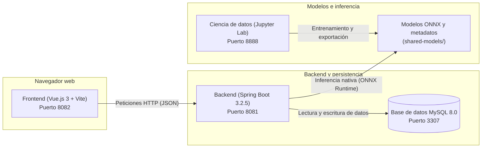

# FinanceAI - Plataforma inteligente de gestión y diagnóstico financiero

FinanceAI es una aplicación web integral diseñada para ayudar a las personas a gestionar sus finanzas personales de forma simple e informada. La plataforma permite registrar ingresos y gastos, clasificar automáticamente los movimientos mediante inteligencia artificial, evaluar el estado de salud financiera del usuario y generar recomendaciones personalizadas para optimizar su presupuesto.

---

## Arquitectura general del sistema

El proyecto está estructurado como una solución modular de cuatro componentes principales que se comunican entre sí de forma desacoplada y predecible:

1. **Frontend (interfaz de usuario)**: Aplicación web interactiva de una sola página (SPA) desarrollada con Vue.js 3, Pinia y Tailwind CSS. Es la pantalla donde el usuario interactúa, carga transacciones, visualiza gráficos y consulta su estado financiero.
2. **Backend (servidor de aplicaciones)**: API REST construida con Java 17 y Spring Boot 3.2.5. Se encarga de la lógica de negocio, la persistencia de datos, el cifrado de credenciales y la ejecución de los modelos de inteligencia artificial de forma nativa.
3. **Base de datos (persistencia)**: Servidor relacional MySQL 8.0 gestionado mediante migraciones automáticas con Flyway, garantizando un esquema de datos consistente y reproducible.
4. **Ciencia de datos y modelos (inteligencia artificial)**: Entorno de experimentación en Jupyter Lab con Python y Scikit-Learn. Los modelos entrenados se exportan al formato estándar ONNX, permitiendo que el backend de Java los ejecute directamente a gran velocidad sin necesidad de mantener un servidor de Python en producción.



---

## Contenedores, servicios y puertos

La plataforma se despliega de manera homogénea mediante Docker Compose. Cada servicio cuenta con puertos mapeados localmente y límites de consumo de recursos para no sobrecargar el equipo:

| Servicio | Tecnología | Puerto local | Puerto interno | Descripción del componente |
| :--- | :--- | :--- | :--- | :--- |
| **frontend** | Node 22 / Vue.js 3 + Vite | `http://localhost:8082` | `3000` | Interfaz visual, paneles de control y gráficos interactivos |
| **backend** | Java 17 / Spring Boot 3.2.5 | `http://localhost:8081` | `8080` | API REST, lógica de análisis y motor de inferencia ONNX |
| **db** | MySQL 8.0 | `localhost:3307` | `3306` | Base de datos relacional para usuarios, transacciones e historial |
| **data-science** | Jupyter Lab / Python 3 | `http://localhost:8888` | `8888` | Cuadernos de simulación, análisis exploratorio y entrenamiento |

> [!NOTE]
> Por seguridad, los puertos de host están vinculados estrictamente a la dirección local `127.0.0.1`. Esto evita que los servicios queden expuestos a otros dispositivos dentro de redes locales compartidas o públicas.

---

## Guía de inicio rápido y configuración local

Sigue estos pasos para poner en funcionamiento todo el entorno en tu computadora:

### 1. Preparar los archivos de configuración
Por motivos de seguridad y buenas prácticas, las contraseñas y variables de entorno no se incluyen directamente en el control de versiones. Debes crear tus archivos locales copiando las plantillas de ejemplo:

* **Variables de entorno:** Copia el archivo `.env.example` y renómbralo como `.env`.
* **Ajustes de Docker:** Copia el archivo `docker-compose.override.yml.example` y renómbralo como `docker-compose.override.yml`.

En sistemas Linux o macOS puedes ejecutar:
```bash
cp .env.example .env
cp docker-compose.override.yml.example docker-compose.override.yml
```

En Windows (PowerShell):
```powershell
Copy-Item .env.example .env
Copy-Item docker-compose.override.yml.example docker-compose.override.yml
```

### 2. Iniciar los contenedores
Ejecuta el siguiente comando en la raíz del proyecto para descargar las imágenes, compilar los servicios y arrancarlos en segundo plano:

```bash
docker compose up -d
```

### 3. Verificar el funcionamiento
Una vez que el comando finalice, puedes ingresar a las siguientes direcciones desde tu navegador:

* Interfaz web: [http://localhost:8082](http://localhost:8082)
* Estado de la API: [http://localhost:8081](http://localhost:8081)
* Entorno de cuadernos: [http://localhost:8888](http://localhost:8888)

Para inspeccionar los registros (logs) del backend en caso de verificar la compilación y conexión con la base de datos:
```bash
docker compose logs -f backend
```

### 4. Detener el entorno
Cuando termines de trabajar, puedes apagar los servicios de forma ordenada sin perder los datos guardados en la base de datos:
```bash
docker compose down
```

---

## Inteligencia artificial y metodología de análisis

FinanceAI utiliza dos modelos de aprendizaje automático serializados en formato ONNX para brindar una experiencia automatizada y personalizada:

### 1. Clasificación automática de transacciones (NLP)
Cuando el usuario ingresa una descripción en texto libre (por ejemplo, "compra en supermercado", "pago de luz", "boleto de colectivo"), el modelo de procesamiento de lenguaje natural analiza el texto y lo asigna a una de las **10 categorías oficiales**:

* `Alimentacion`
* `Educacion`
* `Electrodomesticos`
* `Inversion`
* `Ocio`
* `Salud`
* `Servicios`
* `Transporte`
* `Vestimenta`
* `Vivienda`

El pipeline utiliza representación por frecuencia inversa de documentos (TF-IDF) y un clasificador lineal. Para evitar fallos por tildes o caracteres especiales, el backend aplica una normalización previa de texto antes de llamar al modelo.

### 2. Diagnóstico de perfil financiero
El motor analiza los indicadores económicos del usuario y lo clasifica en una de tres categorías de salud financiera:

* **Saludable**: Estructura de gastos equilibrada, bajo nivel de compromiso sobre el ingreso y disciplina periódica de ahorro.
* **En observación**: Nivel de gastos fijos moderadamente alto o capacidad de ahorro irregular. Requiere atención preventiva en gastos no esenciales.
* **En riesgo**: Gastos fijos o deudas que comprometen una porción excesiva de los ingresos mensuales, con ahorro nulo o insuficiente para absorber contingencias.

### 3. Generación de recomendaciones
A partir del perfil diagnosticado y de la distribución real de gastos por categoría, el sistema elabora sugerencias prácticas en lenguaje natural, tales como límites de presupuesto en categorías críticas, pautas de ahorro mensual y estrategias de desendeudamiento.

---

## Seguridad y buenas prácticas aplicadas

* **Cifrado de contraseñas**: El backend utiliza el algoritmo seguro `BCryptPasswordEncoder` para almacenar las claves de los usuarios. El frontend envía la contraseña en texto plano mediante el canal seguro (HTTPS/HTTP interno) y delega el cálculo del hash unidireccional exclusivamente al servidor, evitando vulnerabilidades de reenvío de hashes.
* **Aislamiento de red**: La base de datos MySQL opera dentro de la red privada de Docker y solo acepta conexiones autorizadas del backend.
* **Control de consumo de memoria**: Se establecieron límites de memoria RAM y CPU en `docker-compose.yml` para evitar ralentizaciones en equipos de desarrollo con recursos limitados.
* **Reinicio manual (`restart: "no"`)**: Los contenedores solo se inician cuando el desarrollador ejecuta `docker compose up`, evitando que consuman memoria de fondo al encender la computadora.

---

## Estructura del repositorio

```text
├── backend/               # Proyecto Java 17 con Spring Boot, controladores y servicios
├── frontend/              # Aplicación web en Vue.js 3, componentes, vistas y Pinia
├── notebooks/             # Cuadernos Jupyter, simulación de datos y entrenamiento de modelos
├── shared-models/         # Modelos serializados (.onnx) y archivo de metadatos (metadata.json)
├── docker-compose.yml     # Orquestación principal de contenedores y definición de servicios
├── .env.example           # Plantilla de variables de entorno para desarrollo local
└── README.md              # Documentación general del proyecto
```

Para consultar detalles específicos de implementación, configuración interna y comandos de cada área, revisa los archivos de documentación dentro de cada subdirectorio: [backend/README.md](./backend/README.md), [frontend/README.md](./frontend/README.md), [notebooks/README.md](./notebooks/README.md) y [shared-models/README.md](./shared-models/README.md).
