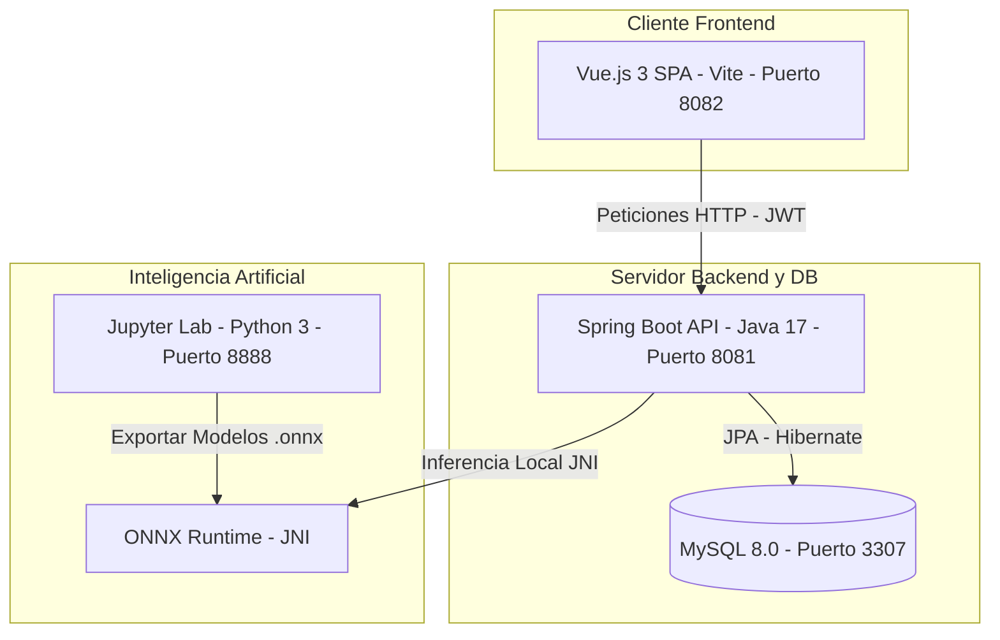
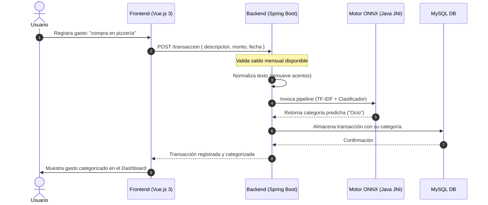

# FinanceAI

<div align="center">


**Plataforma inteligente de gestión de finanzas personales con clasificación automática de gastos mediante Inteligencia Artificial y diagnóstico automatizado de salud financiera.**

</div>

---

## 📺 Demostración en Video

Haz clic en la imagen a continuación para ver una demostración completa en video de **FinanceAI** en YouTube:

<div align="center">

[](
https://github.com/user-attachments/assets/fbaf41d1-daed-4670-b0df-af0142ab67b1)

*🎥 [Ver demostración en YouTube](https://www.youtube.com/watch?v=5nUoQf9ThZI)*

</div>

---

## 📌 Tabla de Contenidos
1. [Acerca del Proyecto](#-acerca-del-proyecto)
2. [Arquitectura del Sistema](#-arquitectura-del-sistema)
3. [Tecnologías Utilizadas](#-tecnologías-utilizadas)
4. [Inteligencia Artificial y Metodología](#-inteligencia-artificial-y-metodología)
5. [Estructura del Proyecto](#-estructura-del-proyecto)
6. [Seguridad y Buenas Prácticas](#-seguridad-y-buenas-prácticas)
7. [Instalación y Configuración Local](#-instalación-y-configuración-local)
8. [Equipo y Roles](#-equipo-y-roles)
9. [Licencia](#-licencia)

---

## 🚀 Acerca del Proyecto

**FinanceAI** es una aplicación web interactiva diseñada para revolucionar la forma en que los usuarios administran y analizan sus finanzas personales. Va más allá de las hojas de cálculo tradicionales al integrar técnicas avanzadas de procesamiento de lenguaje natural y análisis predictivo para automatizar tareas repetitivas y ofrecer información financiera de alto valor.

### Características Principales:
* **Clasificación Inteligente (NLP)**: Escribe tus gastos como desees (ej: *"cena familiar en pizzería"*, *"boleto de tren a oficinas"*) y el modelo clasifica automáticamente el concepto en su categoría correcta.
* **Control de Capacidad Real**: El sistema calcula tu capacidad de gasto mensual basándose estrictamente en tus ingresos fijos de ese mes menos los consumos corrientes, protegiendo tus presupuestos de sobregiros.
* **Diagnóstico Financiero Continuo**: Un motor evalúa tus hábitos de consumo basándose en tus deudas, ingresos y capacidad de ahorro recurrente, clasificando tu perfil de salud en *Saludable*, *En observación* o *En riesgo*.
* **Recomendaciones Inteligentes**: Genera consejos prácticos específicos en base a tu perfil, sugiriendo límites por categoría de consumo e incentivando el ahorro acumulativo.

---

## 🏗️ Arquitectura del Sistema

El proyecto implementa una arquitectura desacoplada de cuatro componentes autónomos orquestados mediante contenedores de Docker.

### Diagrama de Componentes


### Flujo de Registro y Clasificación de Transacciones


---

## 🛠️ Tecnologías Utilizadas

La solución está construida combinando tecnologías empresariales con herramientas modernas de ciencia de datos:

* **Backend & API Layer**:
  * **Java 17** & **Spring Boot 3.2.5** (Spring Web, Spring Data JPA, Spring Security).
  * **Flyway** para la gestión del historial de migraciones de base de datos.
  * **ONNX Runtime Java** para la inferencia ultrarrápida del modelo sin llamadas HTTP a Python.
* **Frontend Layer**:
  * **Vue.js 3** (Composition API, Script Setup).
  * **Vite** para construcción optimizada.
  * **Pinia** para la gestión de estados globales.
  * **Tailwind CSS** para un diseño estético y fluido.
  * **Vitest** para la ejecución de pruebas unitarias.
* **Persistencia**:
  * **MySQL 8.0** para la base de datos relacional.
* **Ciencia de Datos & DevOps**:
  * **Python 3**, **Scikit-Learn** & **Jupyter Lab** para entrenamiento y análisis.
  * **Docker** & **Docker Compose** para orquestación e infraestructura local reproducible.

---

## 🧠 Inteligencia Artificial y Metodología

Para mantener una arquitectura eficiente y rápida, los modelos de Inteligencia Artificial se entrenan en Python pero se ejecutan localmente en Java usando el motor nativo de **ONNX**:

1. **Clasificación NLP de Transacciones**:
   El modelo utiliza un pipeline compuesto por una vectorización por frecuencia inversa de documentos (TF-IDF) y un clasificador lineal entrenado para reconocer patrones semánticos y asignar los textos a una de las **10 categorías oficiales**:
   * *Alimentación, Educación, Electrodomésticos, Inversión, Ocio, Salud, Servicios, Transporte, Vestimenta y Vivienda.*
2. **Evaluación de Perfil de Salud Financiera**:
   El algoritmo clasifica las finanzas del usuario según sus ratios de endeudamiento y capacidad de ahorro periódico en tres estados:
   * **Saludable**: Consumo equilibrado, margen óptimo de ahorro e ingresos suficientes.
   * **En observación**: Ahorro irregular o aumento de gastos fijos (servicios/vivienda). Requiere atención.
   * **En riesgo**: Gastos fijos o deudas comprometen una porción excesiva de los ingresos mensuales.

---

## 📂 Estructura del Proyecto

```text
├── backend/               # Servidor de aplicaciones Spring Boot (Java 17)
│   ├── src/               # Código fuente (Controladores, Servicios, Seguridad)
│   └── pom.xml            # Dependencias de Maven y configuración de build
├── frontend/              # Interfaz interactiva SPA (Vue.js 3)
│   ├── src/               # Vistas, Componentes de Dashboard, Stores de Pinia
│   ├── package.json       # Scripts npm y librerías frontend
│   └── vite.config.js     # Configuración de compilación y servidor local
├── notebooks/             # Entorno Jupyter Lab y scripts de ciencia de datos
│   └── *.ipynb            # Cuadernos de análisis y entrenamiento de modelos
├── shared-models/         # Carpeta compartida con modelos exportados
│   ├── *.onnx             # Modelos serializados de clasificación y salud
│   └── metadata.json      # Metadatos del entrenamiento (vocabulario de categorías)
├── docker-compose.yml     # Orquestación de contenedores Docker
└── README.md              # Documento principal del repositorio
```

---

## 🔒 Seguridad y Buenas Prácticas

* **Protección de Credenciales**: Las contraseñas se encriptan de extremo a extremo utilizando el algoritmo robusto `BCryptPasswordEncoder` en el backend.
* **Aislamiento de Infraestructura**: El motor de base de datos MySQL se ejecuta dentro de la red privada de Docker sin exposición pública, solo accesible para el backend.
* **Persistencia de Sesión Segura**: Manejo híbrido de autenticación JWT guardado localmente, permitiendo restablecer el estado correcto (incluyendo el modo demo) sin pérdida de información al refrescar la ventana.

---

## ⚙️ Instalación y Configuración Local

Sigue estas instrucciones para levantar todo el proyecto localmente sin fricciones:

### Requisitos Previos:
* Tener instalado **Docker** y **Docker Compose** en tu sistema operativo.

### Pasos:

1. **Clonar el repositorio**:
   ```bash
   git clone https://github.com/No-Country-simulation/G9-LATAM-Team-11-FinanceAI.git
   cd G9-LATAM-Team-11-FinanceAI
   ```

2. **Preparar archivos de entorno (.env)**:
   Duplica la plantilla de variables de entorno y el archivo de anulación de Docker Compose:
   * **En Linux/macOS:**
     ```bash
     cp .env.example .env
     cp docker-compose.override.yml.example docker-compose.override.yml
     ```
   * **En Windows (PowerShell):**
     ```powershell
     Copy-Item .env.example .env
     Copy-Item docker-compose.override.yml.example docker-compose.override.yml
     ```

3. **Construir y arrancar contenedores**:
   Ejecuta el comando de Docker Compose para compilar e iniciar los servicios en segundo plano:
   ```bash
   docker compose up -d --build
   ```

4. **Acceder a los servicios**:
   Una vez completada la compilación, ingresa a las URLs locales:
   * **Aplicación Web (Frontend)**: [http://localhost:8082](http://localhost:8082)
   * **Servidor API (Backend)**: [http://localhost:8081](http://localhost:8081)
   * **Entorno Jupyter (Ciencia de datos)**: [http://localhost:8888](http://localhost:8888)

5. **Detener el entorno**:
   Para apagar los contenedores conservando los datos:
   ```bash
   docker compose down
   ```

---

## 👥 Equipo y Roles

| Nombre | Rol | GitHub Profile |
| :--- | :--- | :--- |
| **Gabriel Estrada** | Backend Developer | [@Gabum-on-Drums](https://github.com/Gabum-on-Drums) |
| **Cesar Maximiliano Chanan Romero** | Backend Developer | [@maxichanan](https://github.com/maxichanan) |
| **Joel Israel Escalante Garcia** | Backend Developer | [@Joelescalante12](https://github.com/Joelescalante12) |
| **Nicole Fernandez** | Frontend Developer | [@Zhainy](https://github.com/Zhainy) |
| **Christian Quidel** | Data Scientist | [@reddjedet](https://github.com/reddjedet) |
| **Esteban David Galdames** | Data Scientist | [@EstebanDavidGaldames](https://github.com/EstebanDavidGaldames) |
| **Starlyn Manuel Duarte Guzman** | Data Analyst | [@DstarG6](https://github.com/DstarG6) |
| **Oscar Alderete** | Data Engineer | - |

---

## 📄 Licencia

Este proyecto se distribuye bajo la licencia **MIT**. Consulta el archivo `LICENSE` para obtener más detalles.
